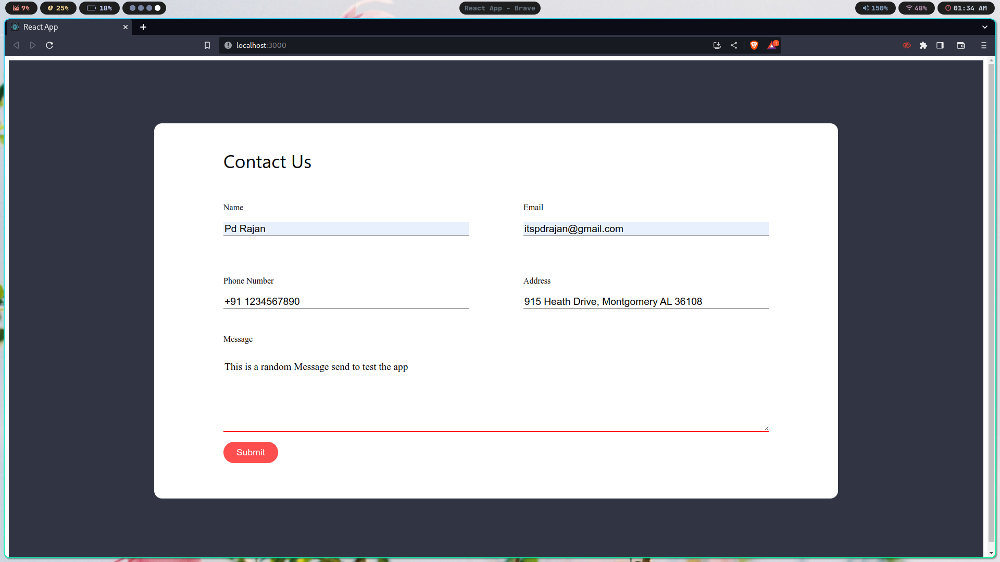
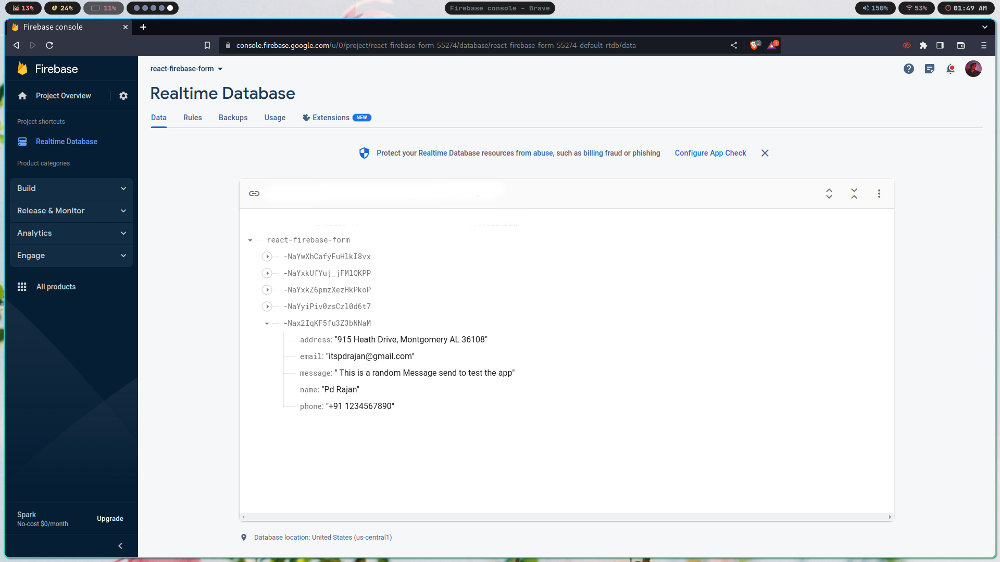

# React Firebase Form


## Overview

React Firebase Form is a simple contact form built using React.js and Firebase. It allows users to submit their contact information and messages, which are stored in a Firebase Realtime Database.

### Preview



## Features

- Responsive and user-friendly contact form.
- Input validation to ensure all required fields are filled.
- Data submission to Firebase Realtime Database using Firebase API.

## How to Use

1. Clone the repository to your local machine:

```bash
git clone https://github.com/your-username/react-firebase-form.git
```
Install the required dependencies:
```
cd react-firebase-form
npm install
```

Run the application:
```
npm start
```